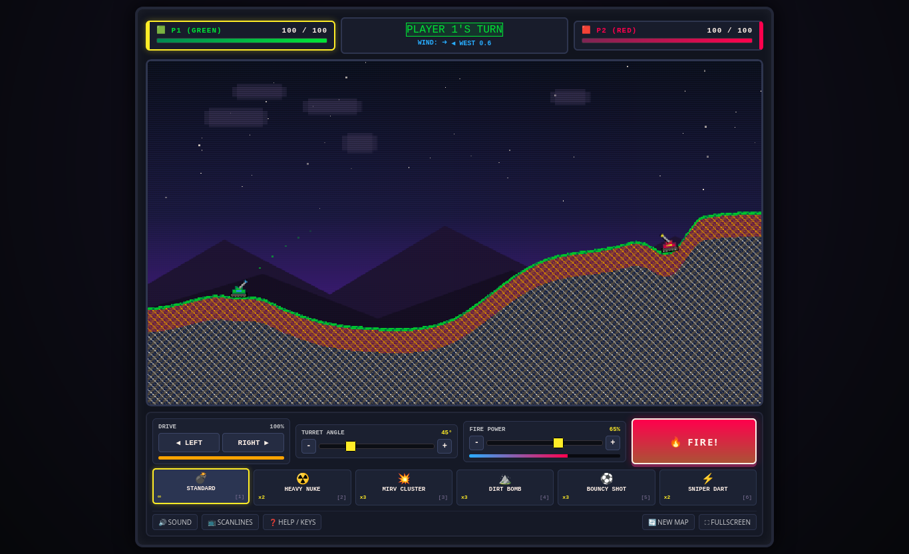

# 🎮 Retro Tank Battle (2-Player Turn-Based Scorched Earth)



### 🌐 [Play Live Demo on GitHub Pages](https://kothf.github.io/tank-battle/)

A complete, retro-styled 2-player local turn-based tank artillery battle game inspired by classics such as **Scorched Earth**, **Pocket Tanks**, and **Artillery**, built completely with vanilla HTML5, CSS3, modern JavaScript, HTML5 `<canvas>`, and the Web Audio API. Zero external dependencies.

---

## 🌟 Key Features

### 1. Retro Pixel-Art Architecture
- **Virtual Native Resolution:** Internal 640x360 pixel-art canvas.
- **Crisp Pixel Scaling:** Scaled via CSS `image-rendering: pixelated` and `image-rendering: crisp-edges` with responsive arcade framing.
- **Pico-8 / EGA 16-Color Palette:** Vibrant retro tones including layered dithered dirt, rock substrata, rolling hills, twinkling night skies, and animated clouds.
- **CRT Scanlines Mode:** Built-in scanlines toggle button for an authentic arcade cabinet look.

### 2. Fully Destructible Procedural Terrain
- **Procedural Heightmap:** Multi-octave harmonic sine & Perlin-like curves generated at each match start with safe, smoothed tank spawn plateaus.
- **Pixel-Level Destructibility:** Projectiles carve true circular craters out of the landscape.
- **Sand-Slide & Gravity Logic:** Unsupported floating earth falls straight down into air pockets beneath it, and steep vertical cliffs naturally crumble at the angle of repose.
- **Slope-Tracking Tanks:** Tanks detect terrain elevation beneath both treads and rotate smoothly to match the slope.
- **Collapse & Fall Damage:** If earth under a tank is destroyed, the tank falls with gravity. Landing after a significant drop inflicts realistic fall damage with dust impacts and crunch sounds.

### 3. Dynamic Web Audio API Sound Synthesizer
- **Zero External Audio Files:** All retro 8-bit sound effects are generated dynamically via procedural oscillators, filters, noise buffers, and envelopes.
- **Sound Palette:** Cannon thumps, massive thermonuclear sub-bass booms, MIRV apex separation pops, dirt deposit rumbles, bouncy shell chirps, engine chugging while driving, impact crunches, UI clicks, and an 8-bit victory fanfare.

### 4. Rich Arsenal & Weapon Mechanics
1. **💣 Standard Shell (Infinite Ammo):** Classic cannon shell with balanced trajectory, direct damage (42 HP), and splash damage (32 HP).
2. **☢️ Heavy Nuke (x2 Ammo):** High-mass thermonuclear payload with lower velocity, massive blast crater (54px radius), 85 direct damage, blinding flash, and screen shake.
3. **💥 MIRV Cluster (x3 Ammo):** Artillery missile that automatically separates at the apex of its arc into **5 distinct bomblets**, blanketing the terrain.
4. **⛰️ Dirt Bomb / Terraformer (x3 Ammo):** Non-lethal terraforming warhead that deposits a massive solid earthen dome to bury enemies, seal craters, or create defensive ramparts.
5. **⚽ Bouncy Shot (x3 Ammo):** Rubber-coated explosive shell that bounces off terrain up to 3 times or rolls down slopes before detonating.
6. **⚡ Sniper Piercer (x2 Ammo):** Ultra-high-velocity kinetic slug with flat trajectory that pierces through hills and armor.

### 5. Environmental Physics
- **Dynamic Wind Indicator:** Randomized wind speed and direction on each turn affecting the horizontal velocity of all projectiles in flight.
- **Drifting Atmospheric Clouds:** Background clouds and wind particles drift in accordance with wind speed.
- **Continuous Collision Detection (CCD):** Sub-stepped raycast verification ensures projectiles never tunnel through thin terrain walls or tanks.
- **Stratosphere Tracker:** High-altitude shells soaring above the screen display an off-screen tracker marker with altitude readout.

---

## 🕹️ Controls

The game supports both **full keyboard shortcuts** and **on-screen touch/mouse buttons** for desktop, tablet, and mobile play:

| Action | Keyboard Shortcut | On-Screen Control |
| :--- | :--- | :--- |
| **Drive Tank** | `A` / `D` or `◀` / `▶` Arrow keys | `◀ LEFT` / `RIGHT ▶` buttons (hold to drive) |
| **Aim Angle** | `W` / `S` or `▲` / `▼` Arrow keys | Angle slider, `[-]` / `[+]` buttons, or click/drag directly on canvas |
| **Fire Power** | `Q` / `E` | Power slider, `[-]` / `[+]` buttons |
| **Choose Weapon** | Number keys `1` through `6` | Click weapon inventory cards |
| **FIRE!** | `SPACE` or `ENTER` | Big red `🔥 FIRE!` button |
| **Toggle Sound** | `M` | `🔊 SOUND` button |
| **Toggle Scanlines** | — | `📺 SCANLINES` button |
| **Help Manual** | `H` | `❓ HELP / KEYS` button |
| **Restart / New Map** | `R` | `🔄 NEW MAP` / `⚔️ REMATCH` button |
| **Fullscreen** | — | `⛶ FULLSCREEN` button |

---

## 🚀 How to Run

Because the project uses pure vanilla HTML5, CSS3, and JavaScript with zero external dependencies and standard relative scripts, you can run it immediately in any of the following ways:

### Method 1: Direct File Open
Simply double-click `index.html` in your file manager or open it directly in any web browser.

### Method 2: Local Web Server (Optional)
If you prefer running via a local HTTP server:
```bash
cd tank-battle
python3 -m http.server 8080
```
Then visit `http://localhost:8080` in your browser.
