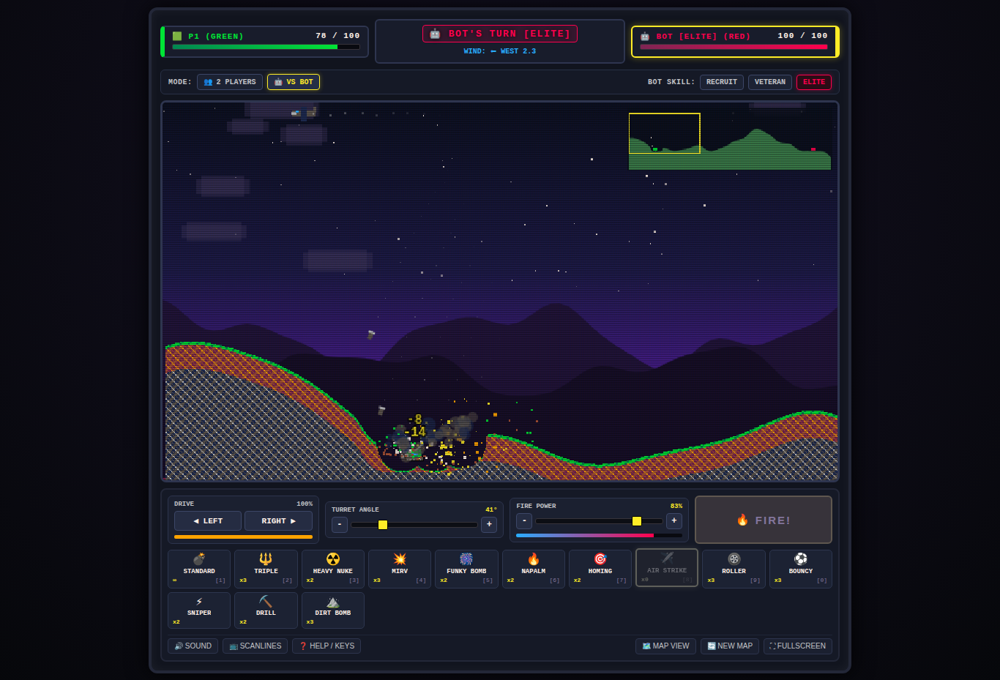

# 🎮 Retro Tank Battle (Turn-Based Scorched Earth with AI Bot)



### 🌐 [Play Live Demo on GitHub Pages](https://kothf.github.io/tank-battle/) · [Play on aerocat.tech](https://aerocat.tech/games/tank-battle/)

A retro turn-based tank artillery game inspired by **Scorched Earth**, **Pocket Tanks** and **Worms**, built with vanilla HTML5, CSS3, JavaScript, `<canvas>` and the Web Audio API. Play 2-player local multiplayer or solo against an AI bot with three skill levels. Zero external dependencies.

---

## 🌟 Key Features

### 1. 🗺️ Scrolling Battlefield
- **Three map sizes**, 540 px tall, seen through a crisp pixel view 360 rows tall whose width follows your window (16:9 = 640 px, wider in fullscreen): Small 1200 px, Medium 1800 px and Large 2800 px wide (about 2, 3 and 4.5 screens). Shell speed scales with the map, so the same power setting crosses the same share of any field.
- **Fullscreen** (button or `F`) fits the whole cabinet on the screen with no scrolling.
- **Camera** frames both tanks while you aim (zooming out as far as the map needs; markers float above the tanks when they get small), then follows the shell in flight and the explosion.
- **Mouse wheel** zooms, **`V`** shows the whole battlefield, **`C`** re-centres, and the **minimap** (click/drag) lets you look around.
- **Edge markers** point to off-screen shells (with altitude) and the enemy tank (with distance).
- Random spawn points on every map; cannon range and fuel sized for the larger field.

### 2. 💣 13-Weapon Arsenal
Damage is balanced against the 100 HP tank pool for multi-turn duels.

| # | Weapon | Ammo | Behaviour |
|:-:|:--|:-:|:--|
| 1 | 💣 Standard Shell | ∞ | Balanced cannon shell (25 direct / 16 splash) |
| 2 | 🔱 Triple Shot | 3 | Three shells in a 5° spread (14 / 9 each) |
| 3 | ☢️ Heavy Nuke | 2 | Slow, heavy, 50 px crater (50 / 35), flash and shake |
| 4 | 💥 MIRV Cluster | 3 | Splits at the apex into 5 bomblets (14 / 10 each) |
| 5 | 🎆 Funky Bomb | 2 | Bursts on impact into 6 bouncing bomblets |
| 6 | 🔥 Napalm | 2 | Burning fuel runs downhill and scorches tanks in the pool |
| 7 | 🎯 Homing Missile | 2 | Locks on at the apex, cruises above the hills, dives on the enemy |
| 8 | ✈️ Air Strike | 1 | Smoke marker; a bomber drops 5 bombs along the mark |
| 9 | 🛞 Roller | 3 | Lands and rolls downhill; explodes on a tank, a wall, or when it stops |
| 0 | ⚽ Bouncy Shot | 3 | Bounces off terrain up to 3 times (28 / 18) |
| — | ⚡ Sniper Piercer | 2 | Flat, fast slug that pierces hills (35 / 12) |
| — | ⛏️ Tunnel Drill | 2 | Burrows through mountains; proximity fuse under the enemy (32 / 20) |
| — | ⛰️ Dirt Bomb | 3 | Raises an earth dome to bury a tank or build a wall |

### 3. 🤖 AI Bot (Selectable Skill)
- **Ballistic search:** simulates candidate shots with the game's own physics (wind, gravity, 2-px terrain collision), then refines to 0.5° / 0.25% power.
- **Difficulty = aiming error at the target**, so skill feels the same at any range:
  - **🟢 Recruit:** aims 30–120 px off and usually ignores the wind.
  - **🟡 Veteran:** aims up to ±45 px off, reads the wind roughly.
  - **🔴 Elite:** within a few pixels.
- **Brackets like a gunner:** if nothing moved and nobody was hit, it keeps its weapon and angle and corrects only the power, halving its error each shot.
- **Situational weapons:** drill, homing or air strike over a ridge; napalm or roller into a hollow; nuke to finish you off.
- **Arcade pacing:** thinks, drives (only when hit or on a steep slope), turns the turret and slides the power gauge before firing.

### 4. Destructible Procedural Terrain
- Multi-octave heightmap with flattened spawn pads, Pico-8 / EGA palette, dithered grass, soil and rock strata.
- True circular craters, gravity collapse of overhangs, sand-slide down steep steps, earth domes from the Dirt Bomb.
- Tanks follow the slope under their tracks (the barrel and shot tilt with the hull) and take fall damage (from 18 px, capped at 30 HP).

### 5. Performance
- **Fixed 60 Hz simulation** — the same game speed on 60, 120 or 144 Hz screens.
- **Dirty-rectangle terrain:** craters are applied to the grid immediately, while gravity, sand-slide and repainting run once per frame over the changed rows only.
- Particle compaction, culling and a hard cap; pre-rendered sky and tiled parallax mountains; HUD written once per frame, only changed values; cached audio noise buffers.

### 6. Web Audio Synthesizer
All sound is generated live: cannon thumps, nuke sub-bass, MIRV pops, bounce chirps, drill grinding, napalm whoosh, homing lock beeps, bomber drone, engine chug and the victory fanfare. No audio files. Browsers only allow sound after you interact with the page, so it starts with your first click, tap or key press.

---

## 🕹️ Controls

| Action | Keyboard | Mouse / Touch |
| :--- | :--- | :--- |
| **Drive Tank** | `A` / `D` or `◀` / `▶` | `◀ LEFT` / `RIGHT ▶` (hold) |
| **Aim Angle** | `W` / `S` or `▲` / `▼` | Angle slider, `[-]`/`[+]`, or drag near your tank |
| **Fire Power** | `Q` / `E` | Power slider, `[-]`/`[+]` |
| **Choose Weapon** | `1`–`9`, `0`; `[` / `]` to cycle | Click weapon cards |
| **FIRE!** | `SPACE` or `ENTER` | `🔥 FIRE!` |
| **Whole-map View** | `V` | `🗺️ MAP VIEW` |
| **Re-centre Camera** | `C` | — |
| **Zoom / Look Around** | — | Mouse wheel / click the minimap |
| **Sound / Help** | `M` / `H` | `🔊 SOUND ON` / `❓ HELP / KEYS` |
| **Fullscreen** | `F` | `⛶ FULLSCREEN` |
| **Mode / Bot Skill** | — | `👥 2 PLAYERS` / `🤖 VS BOT`, `RECRUIT` / `VETERAN` / `ELITE` |
| **New Map** | — | `🔄 NEW MAP` / `⚔️ REMATCH` |

---

## 🚀 How to Run

No build step and no runtime dependencies.

- **Open the file:** double-click `index.html`.
- **Or serve it locally:** `npm run serve` (or `python3 -m http.server 8080`) and visit `http://localhost:8080`.

---

## 🛠️ Development & Releases

```bash
npm ci                                  # dev tooling only (Playwright)
npx playwright install chromium         # once
npm test                                # headless smoke test, seeded and deterministic
npm run package                         # dist/tank-battle/ + versioned .tar.gz and .sha256
```

**Releasing**

1. Add the changes under a new version heading in `CHANGELOG.md`.
2. Bump `version` in `package.json` (semver: patch for fixes, minor for features, major for breaking changes such as remapped keys).
3. Commit, then tag and push: `git tag v2.1.0 && git push origin main v2.1.0`.

The **Release** workflow checks that the tag matches `package.json`, runs the tests on the source and on the packaged build, publishes a GitHub release with `tank-battle-<version>.tar.gz` and its SHA-256, and deploys the same build to GitHub Pages. The **CI** workflow runs the same checks on every push and pull request.

Source files reference their scripts as `?v=dev`; packaging stamps the release version into those URLs so CDN caches never mix versions.

**Embedding:** [aerocat.tech](https://aerocat.tech/games/tank-battle/) consumes the release archive pinned by version and checksum; a scheduled workflow there opens a pull request whenever a new release appears.

---

## 📄 License

[MIT](LICENSE) © 2026 Andrey Dumchin
